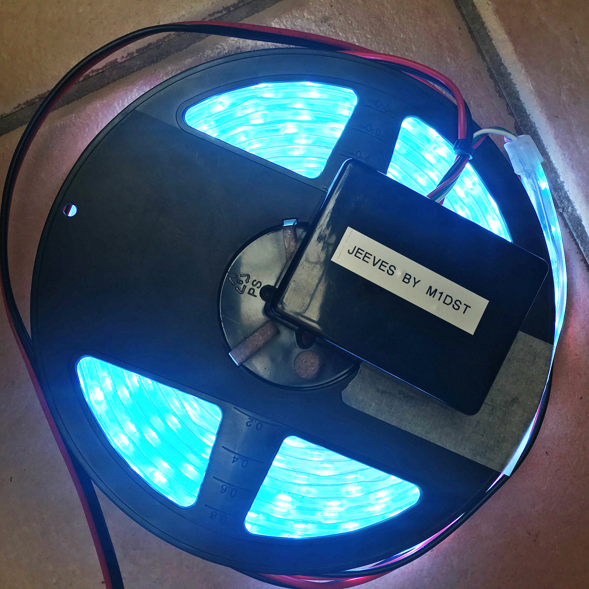

Jeeves
========

Many contest groups around the world use a [hotel/butler bell](http://www.hotelroomsearch.net/im/hotels/gb/bell-hotel-19.jpg) to indicate a multiplier has just been worked.  Jeeves is a modern, automated replacement for the bell which can be installed in or away from the working area.  It also doubles up as 12v lighting for the area.

When a QSO is logged, a packet is broadcast from N1MM+ which Jeeves captures and inspects. Depending on the multiplier status of the QSO, the LED string changes colour and dances to match the 8 possible states.

This is ideal for contest sites where the communal area is away from the working area and a bell may not be heard.  It allows the non operators the fun of keeping track on the progress of the contest.

My installation now requires no setup for a contest other than plugging into a 12v source.

Hardware
--------
* ESP8266 - I used a WeMos D1 Mini v2 ~ £3.50
* 5M string of WS2812 LEDs (300) (12v) ~ £15
* 5v DC/DC to power the ESP from 12v
* Small plastic enclosure.

It is important to use 12V LEDs and power them directly.  You will not be able to power these from the ESP device.  Also consider that you can use even longer runs of LEDs by purchasing another string and plugging it into the end of the original.  The only thing to consider is the volt drop so be prepared to feed 12v directly into each string.  If you don't then you will find the LEDs may sparkle or not show the colour you are expecting.

Setup
-----
* Set your SSID and password by changing the const values.
* Change LED_COUNT to match the number LEDs in your string.
* If you DO NOT want the lights to indicate a non mult QSO was logged, comment out the DISPLAY_EVERY_QSO definition at the top of the sketch.

Future Expansion Ideas
----------------------
* Audible bell.  Suggest the duration is for a very short period of time, perhaps 100ms would be enough to trigger the hammer to sound once.
Could also be used to warn about shift changes?  10 minute warning etc?

* Sniff the current score broadcasts and perhaps expose to a responsive web interface.

* The default state of the LED string is white which is perfect for lighting in a tent.  Lighting may not be required during day.
Perhaps use NTP to work out the time of the day and hardcoded/geopip to determine the rough locaion or country.
With this information it would be possible to calculate sunrise/sunset and set the brightness accordingly.
There is no point in white lights showing during a bright sunny day.

* Win-Test - Not currently possible to check multiplier status due to the limited information Win-Test broadcasts via UDP.
QSO logged and status should be possible though.