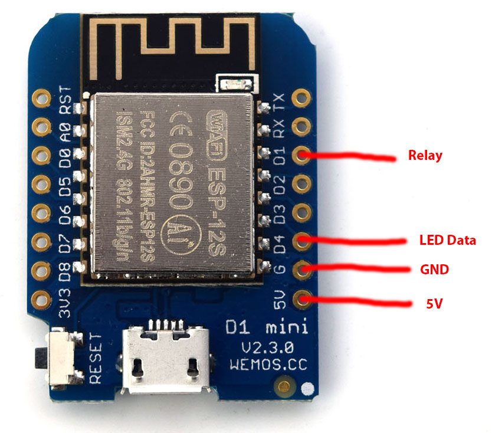

Jeeves
========

Many contest groups around the world use a [hotel/butler bell](http://www.hotelroomsearch.net/im/hotels/gb/bell-hotel-19.jpg) to indicate a multiplier has just been worked.  Jeeves is a modern, automated replacement for the bell which can be installed in or away from the working area.  It also doubles up as 12v lighting for the area.

When a QSO is logged, a packet is broadcast from N1MM+/Win-Test which Jeeves captures and inspects. Depending on the multiplier status of the QSO, the LED string changes colour and dances to match the 8 possible states.

This is ideal for contest sites where the communal area is away from the working area and a bell may not be heard.  It allows the non operators the fun of keeping track on the progress of the contest.

My installation now requires no setup for a contest other than plugging into a 12v source.

Hardware
--------
* ESP8266 - I used a WeMos D1 Mini ~ £3.50
* [5V Relay Module](https://www.aliexpress.com/store/product/Relay-Shield-for-WeMos-D1-mini-button/1331105_32596395175.html) or similar ~ £2.00 - Also available on eBay.
* 5M string of WS2812 LEDs (300) (12v) ~ £15
* [5v DC/DC](https://www.aliexpress.com/item/DC-Power-Shield-V1-0-0-for-WEMOS-D1-mini/32790327733.html) to power the ESP from 12v ~ £2.00 - Also available on eBay.
* Small plastic enclosure.  I 3D printed mine including the powerpole clamps.  STL available if requested.
* Smoothing Capacitor - Connect a big capacitor from power to ground (LEDs). A cap between 100µF and 1000µF should be OK.
* [Mains powered bell](https://www.amazon.co.uk/gp/product/B008SOJO9S) - a 12V bell is more ideal but I couldn't find one at a reasonable price. ~ £9.00

It is important to use 12V LEDs and power them directly.  You will not be able to power these from the ESP8266 device.  Also consider that you can use even longer runs of LEDs by purchasing another string and plugging it into the end of the first.  The only thing to consider is the volt drop so be prepared to feed 12v directly into each string.  If you don't then you will find the LEDs may sparkle or not show the colour you are expecting.

Setup
-----
* Make any changes you require including setting your SSID and password by changing the value in _configuration.h_.
* I am using a relay driven with an optoisolator and transistor.  This means when I want to enable the relay I set the output to LOW.  This is the opposite value required if you were driving a small sounder with just with the digital pin alone.  If you are just driving a sounder/buzzer, then comment out the define statement for RELAY_INVERTED.
* Validate that you have N1MM+ or Win-Test configured for network broadcasts.
    * http://n1mm.hamdocs.com/tiki-index.php?page=UDP+Broadcasts
    * http://docs.win-test.com/wiki/Networking

To work correctly with Win-Test, you are required to configure Win-Teste to post score reports.  We use those UDP packets to calculate the multipler status.  I suggest you set the transmission time to 1 minute to make it as realtime as possible.  Win-Test doesn't transmit multiplier status in the normal ADDQSO packet which means supporting Win-Test was far more complex than N1MM+.

Video
-----
A video is available on [YouTube](https://youtu.be/TC27MBxHUzQ) which shows a working example of Jeeves. [https://youtu.be/TC27MBxHUzQ](https://youtu.be/TC27MBxHUzQ)

3D Printed case with bell

Original prototype

Future Expansion Ideas
----------------------
* Sniff the current score broadcasts and perhaps expose to a responsive web interface.

* The default state of the LED string is white which is perfect for lighting in a tent.  Lighting may not be required during day.
Perhaps use NTP to work out the time of the day and hardcoded/geopip to determine the rough locaion or country.
With this information it would be possible to calculate sunrise/sunset and set the brightness accordingly.
There is no point in white lights showing during a bright sunny day.